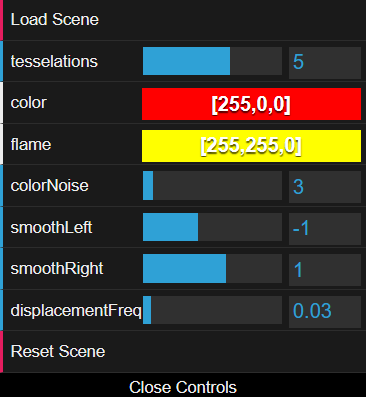

# [Project 1: Noise](https://github.com/CIS-566-Fall-2022/hw01-fireball-base)
Name: Kehan Wang 

Link: https://leoteemo.github.io/hw01-fireball/

## Noise Generation

Toolbox functions used: bias, smoothstep, ease in out, sawtooth wave. 

## Interactivity
Main color and flame color. 
Color Noise Scale. Smooth step left and right edges to control shape. Displacement frequency to speed up a growing cycle. Reset to let the simulation run in default values. 

## Extra Spice

Interesting animated background with use of a few noise functions.

## Publishing Your Code
We highly suggest that you put your code on GitHub. One of the reasons we chose to make this course using JavaScript is that the Web is highly accessible and making your awesome work public and visible can be a huge benefit when you're looking to score a job or internship. To aid you in this process, running `npm run deploy` will automatically build your project and push it to `gh-pages` where it will be visible at `username.github.io/repo-name`.

## Submission

- Update README.md to contain a solid description of your project
- Publish your project to gh-pages. `npm run deploy`. It should now be visible at http://username.github.io/repo-name
- Create a [pull request](https://help.github.com/articles/creating-a-pull-request/) to this repository, and in the comment, include a link to your published project.
- Submit the link to your pull request on Canvas.
